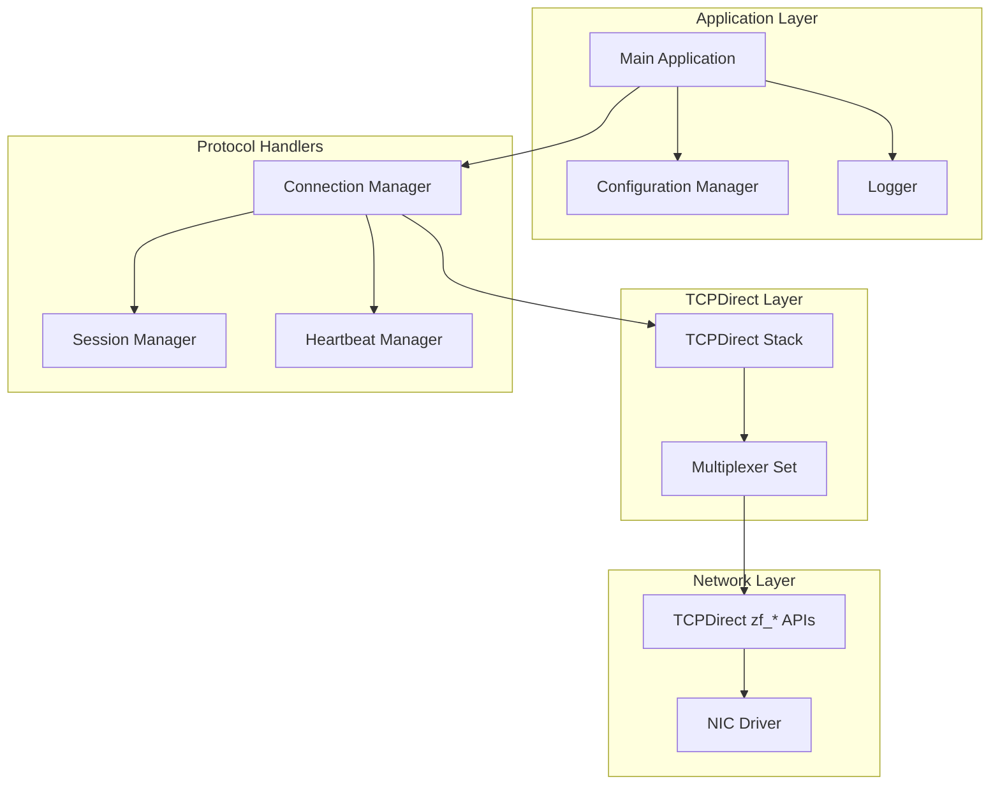
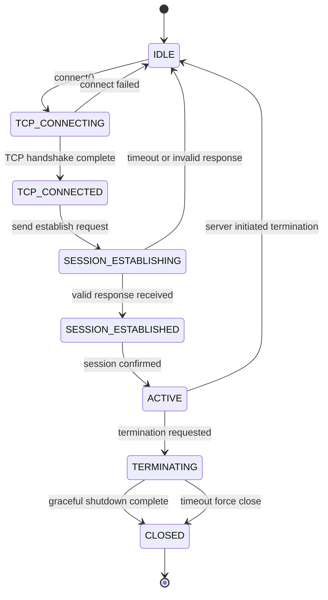
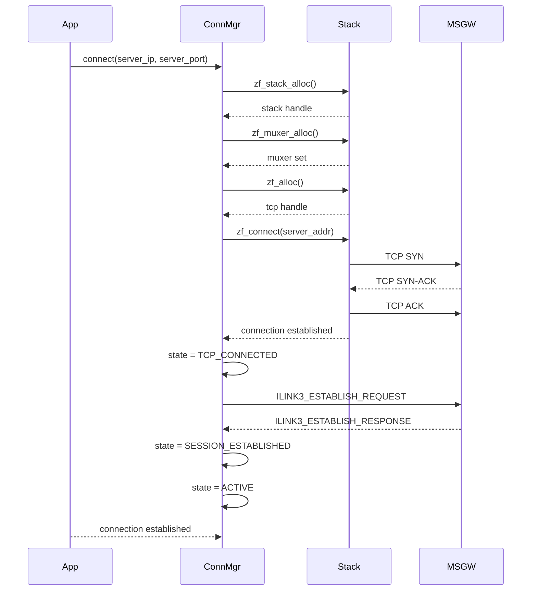
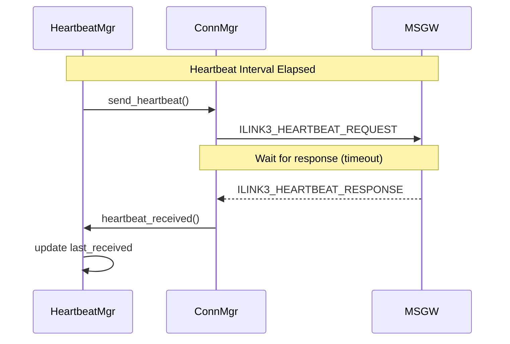
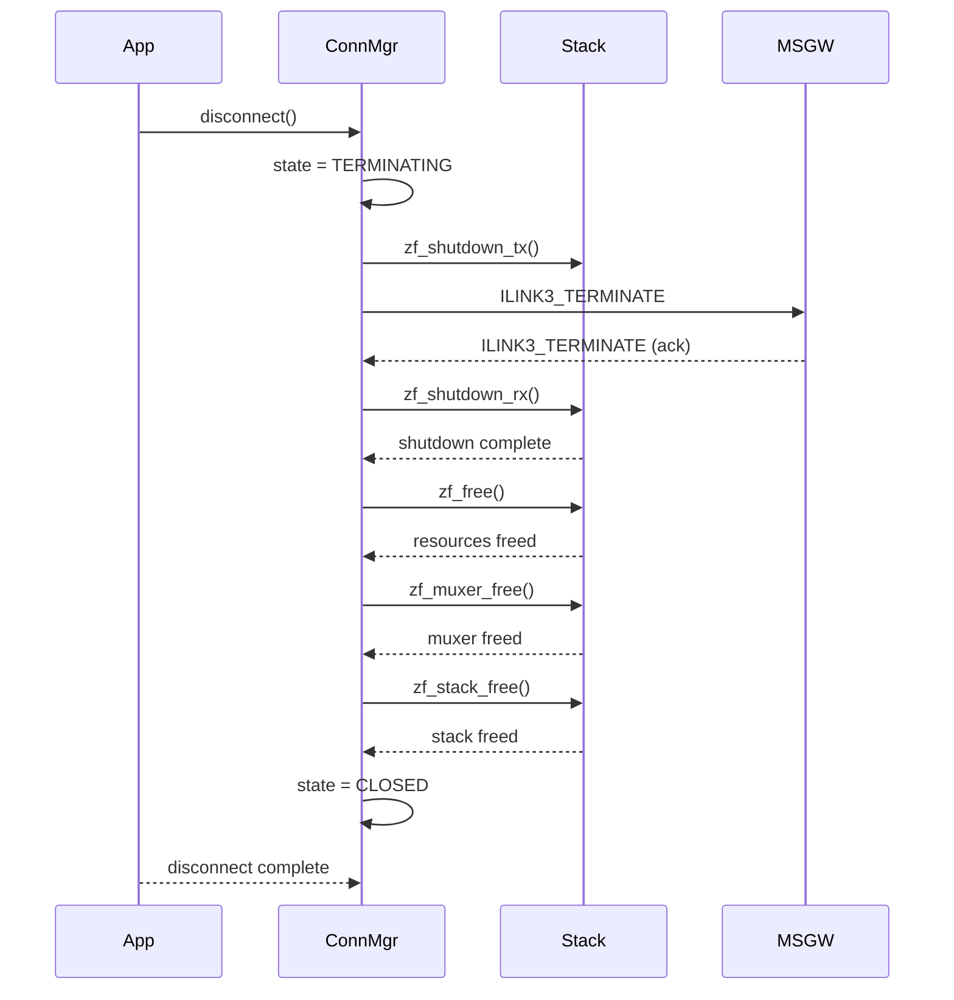

# Design Document

## Overview

This document describes the technical design for a CME iLink3 protocol demo application. The application implements a client-side implementation of the iLink3 protocol version 9, connecting to CME's Market Segment Gateway (MSGW) using TCPDirect (zf_* APIs) for high-performance TCP communication with Solarflare NICs.

The application demonstrates core iLink3 functionality including:
- TCP connection establishment to CME MSGW
- iLink3 session establishment handshake
- Heartbeat message request/response handling
- Graceful connection termination

## Architecture

### High-Level Architecture



### Component Breakdown

#### 1. Configuration Manager

Manages application configuration including:
- CME MSGW IP address and port
- iLink3 protocol version 9
- Heartbeat interval and timeout values
- Logging verbosity level
- Connection retry settings

**Key Functions:**
- `config_init()` - Initialize configuration from command-line args
- `config_validate()` - Validate network configuration
- `config_get_*()` - Accessor functions for configuration values

#### 2. Connection Manager

Manages TCP connection lifecycle and state transitions:
- TCP connection establishment
- State machine transitions
- Error handling for connection failures
- Resource allocation/deallocation

**State Machine:**
- `IDLE` - Initial state
- `TCP_CONNECTING` - TCP connection in progress
- `TCP_CONNECTED` - TCP connection established
- `SESSION_ESTABLISHING` - iLink3 session negotiation
- `SESSION_ESTABLISHED` - Session confirmed
- `ACTIVE` - Normal operation with heartbeat
- `TERMINATING` - Graceful shutdown in progress
- `CLOSED` - Connection fully terminated

#### 3. iLink3 Protocol Handler

Handles iLink3 message encoding/decoding:
- Session establishment request/response
- Heartbeat request/response
- Termination messages
- Protocol validation

**Message Types:**
- `ILINK3_MSG_ESTABLISH_REQUEST` - Session establishment
- `ILINK3_MSG_ESTABLISH_RESPONSE` - Session confirmation
- `ILINK3_MSG_HEARTBEAT_REQUEST` - Keep-alive request
- `ILINK3_MSG_HEARTBEAT_RESPONSE` - Keep-alive response
- `ILINK3_MSG_TERMINATE` - Connection termination

#### 4. Heartbeat Manager

Manages heartbeat message exchange:
- Timer-based heartbeat sending
- Response timeout handling
- Missed heartbeat logging

**Configuration:**
- Heartbeat interval (configurable)
- Response timeout (configurable)
- Maximum missed heartbeats before termination

#### 5. Logger

Provides diagnostic logging:
- Connection events
- Message send/receive
- Error conditions
- Protocol violations

**Log Levels:**
- `ERROR` - Error conditions
- `WARN` - Warning conditions
- `INFO` - General information
- `DEBUG` - Detailed debugging

## Data Structures

### iLink3 Message Header

```c
struct ilink3_header {
    uint8_t  version;        // Protocol version (9)
    uint8_t  message_type;   // Message type
    uint16_t length;         // Total message length
    uint32_t sequence_num;   // Sequence number
    uint32_t timestamp;      // Timestamp (seconds since epoch)
};
```

### Session Establishment Request

```c
struct ilink3_establish_request {
    struct ilink3_header header;
    uint32_t client_id;      // Client identifier
    uint32_t protocol_ver;   // Protocol version (9)
    uint32_t heartbeat_int;  // Heartbeat interval
    uint32_t timeout;        // Response timeout
    char     username[64];   // Authentication username
    char     password[64];   // Authentication password
};
```

### Session Establishment Response

```c
struct ilink3_establish_response {
    struct ilink3_header header;
    uint32_t status;         // 0 = success, non-zero = error
    uint32_t server_id;      // Server identifier
    uint32_t heartbeat_int;  // Confirmed heartbeat interval
    uint32_t timeout;        // Confirmed timeout
};
```

### Heartbeat Request

```c
struct ilink3_heartbeat_request {
    struct ilink3_header header;
    uint32_t timestamp;      // Current timestamp
};
```

### Heartbeat Response

```c
struct ilink3_heartbeat_response {
    struct ilink3_header header;
    uint32_t timestamp;      // Echoed timestamp from request
};
```

### Connection State Structure

```c
enum ilink3_state {
    STATE_IDLE,
    STATE_TCP_CONNECTING,
    STATE_TCP_CONNECTED,
    STATE_SESSION_ESTABLISHING,
    STATE_SESSION_ESTABLISHED,
    STATE_ACTIVE,
    STATE_TERMINATING,
    STATE_CLOSED
};

struct ilink3_connection {
    enum ilink3_state state;
    
    // TCPDirect resources
    struct zf_stack* stack;
    struct zf_muxer_set* muxer;
    struct zft* tcp_socket;
    struct zft_handle* tcp_handle;
    
    // Configuration
    struct sockaddr_in server_addr;
    uint32_t heartbeat_interval;
    uint32_t heartbeat_timeout;
    
    // Session state
    uint32_t sequence_num;
    uint32_t server_id;
    bool session_established;
    
    // Heartbeat state
    struct timespec last_heartbeat_sent;
    struct timespec last_heartbeat_received;
    bool heartbeat_pending;
    
    // Error state
    int last_error;
    char error_msg[256];
};
```

## State Machine

### Connection State Transitions



### State Transition Details

#### IDLE to TCP_CONNECTING

Application calls `ilink3_connect()` with server address. Connection manager allocates TCPDirect resources and initiates TCP connection.

#### TCP_CONNECTING to TCP_CONNECTED

TCP handshake completes. Connection manager transitions state and sends iLink3 session establishment request.

#### TCP_CONNECTING to IDLE

TCP connection fails. Connection manager logs error and releases resources.

#### TCP_CONNECTED to SESSION_ESTABLISHING

TCP connection established. Connection manager sends iLink3 establish request and waits for response.

#### SESSION_ESTABLISHING to SESSION_ESTABLISHED

Valid establish response received. Connection manager confirms session and transitions to ACTIVE state.

#### SESSION_ESTABLISHING to IDLE

Establish response times out or is invalid. Connection manager closes TCP connection and releases resources.

#### SESSION_ESTABLISHED to ACTIVE

Session confirmed. Heartbeat manager starts heartbeat timer.

#### ACTIVE to TERMINATING

Termination requested (user or server). Connection manager initiates graceful shutdown.

#### ACTIVE to IDLE

Server initiates termination. Connection manager handles graceful shutdown.

#### TERMINATING to CLOSED

Graceful shutdown completes or timeout occurs. Connection manager releases all resources.

## Message Flow Diagrams

### Connection Establishment Flow



### Heartbeat Flow



### Termination Flow



## TCPDirect API Usage Patterns

### Stack Initialization

```c
int init_stack(struct zf_stack** stack_out, struct zf_muxer_set** muxer_out) {
    struct zf_attr* attr;
    int rc;
    
    // Allocate attributes
    rc = zf_attr_alloc(&attr);
    if (rc != 0) {
        return rc;
    }
    
    // Configure attributes
    zf_attr_set_str(attr, "interface", "eth0");
    zf_attr_set_int(attr, "log_level", 3);
    zf_attr_set_int(attr, "tcp_rx_buf_len", 65536);
    zf_attr_set_int(attr, "tcp_tx_buf_len", 65536);
    
    // Allocate stack
    rc = zf_stack_alloc(attr, stack_out);
    if (rc != 0) {
        zf_attr_free(attr);
        return rc;
    }
    
    // Allocate multiplexer set
    rc = zf_muxer_alloc(*stack_out, muxer_out);
    if (rc != 0) {
        zf_stack_free(*stack_out);
        zf_attr_free(attr);
        return rc;
    }
    
    zf_attr_free(attr);
    return 0;
}
```

### TCP Connection Establishment

```c
int connect_to_server(struct ilink3_connection* conn) {
    struct zf_attr* attr;
    int rc;
    
    // Allocate TCP handle
    rc = zf_attr_alloc(&attr);
    if (rc != 0) {
        return rc;
    }
    
    rc = zft_alloc(conn->stack, attr, &conn->tcp_handle);
    zf_attr_free(attr);
    if (rc != 0) {
        return rc;
    }
    
    // Connect to server
    rc = zft_connect(conn->tcp_handle, 
                     (struct sockaddr*)&conn->server_addr,
                     sizeof(conn->server_addr),
                     &conn->tcp_socket);
    if (rc != 0) {
        zft_handle_free(conn->tcp_handle);
        return rc;
    }
    
    conn->tcp_handle = NULL;  // Handle consumed by connect
    return 0;
}
```

### Event Loop

```c
void run_event_loop(struct ilink3_connection* conn) {
    struct epoll_event events[16];
    int nfds;
    
    while (conn->state != STATE_CLOSED) {
        // Poll for events with timeout
        nfds = zf_muxer_wait(conn->muxer, events, 16, 100000000); // 100ms
        
        if (nfds > 0) {
            // Process events
            for (int i = 0; i < nfds; i++) {
                process_event(conn, &events[i]);
            }
        }
        
        // Perform stack processing
        zf_reactor_perform(conn->stack);
        
        // Check for heartbeat timeout
        check_heartbeat_timeout(conn);
    }
}
```

### Message Sending

```c
int send_ilink3_message(struct ilink3_connection* conn, 
                        const void* msg, size_t len) {
    struct iovec iov;
    ssize_t sent;
    
    iov.iov_base = (void*)msg;
    iov.iov_len = len;
    
    sent = zft_send(conn->tcp_socket, &iov, 1, 0);
    if (sent < 0) {
        return (int)sent;
    }
    
    return (int)sent;
}
```

### Message Receiving

```c
int receive_ilink3_message(struct ilink3_connection* conn,
                           void* buf, size_t buf_len, size_t* recv_len) {
    struct iovec iov;
    int rc;
    
    iov.iov_base = buf;
    iov.iov_len = buf_len;
    
    rc = zft_recv(conn->tcp_socket, &iov, 1, 0);
    if (rc <= 0) {
        return rc;
    }
    
    *recv_len = (size_t)rc;
    return 0;
}
```

## Error Handling Design

### Error Codes

```c
#define ILINK3_OK                    0
#define ILINK3_ERR_INVALID_ARG      -1
#define ILINK3_ERR_ALLOC_FAILED     -2
#define ILINK3_ERR_TCP_CONNECT      -3
#define ILINK3_ERR_TCP_SEND         -4
#define ILINK3_ERR_TCP_RECV         -5
#define ILINK3_ERR_TIMEOUT          -6
#define ILINK3_ERR_PROTOCOL         -7
#define ILINK3_ERR_SESSION_REJECT   -8
#define ILINK3_ERR_RESOURCE_EXHAUST -9
#define ILINK3_ERR_SHUTDOWN         -10
```

### Error Handling Strategy

1. **Connection Errors**: Log error details and transition to CLOSED state
2. **Protocol Errors**: Log violation details and terminate connection
3. **Resource Errors**: Log exhaustion details and attempt graceful recovery
4. **Timeout Errors**: Log timeout details and take appropriate action

### Error Logging Format

```
[ERROR] [timestamp] [connection_id] [function] - Error message
[WARN]  [timestamp] [connection_id] [function] - Warning message
[INFO]  [timestamp] [connection_id] [function] - Info message
[DEBUG] [timestamp] [connection_id] [function] - Debug message
```

## Resource Management Design

### Resource Allocation

Resources are allocated in the following order:
1. Stack attributes
2. TCPDirect stack
3. Multiplexer set
4. TCP zocket handle
5. TCP zocket (after connect)

### Resource Deallocation

Resources are freed in reverse order:
1. TCP zocket
2. TCP zocket handle (if not consumed)
3. Multiplexer set
4. TCPDirect stack
5. Stack attributes

### Resource Cleanup on Exit

```c
void cleanup_connection(struct ilink3_connection* conn) {
    if (conn->tcp_socket) {
        zft_free(conn->tcp_socket);
        conn->tcp_socket = NULL;
    }
    
    if (conn->tcp_handle) {
        zft_handle_free(conn->tcp_handle);
        conn->tcp_handle = NULL;
    }
    
    if (conn->muxer) {
        zf_muxer_free(conn->muxer);
        conn->muxer = NULL;
    }
    
    if (conn->stack) {
        zf_stack_free(conn->stack);
        conn->stack = NULL;
    }
}
```

## Configuration Structure

```c
struct ilink3_config {
    // Network configuration
    char server_ip[INET_ADDRSTRLEN];
    uint16_t server_port;
    
    // Protocol configuration
    uint8_t protocol_version;  // Must be 9
    
    // Heartbeat configuration
    uint32_t heartbeat_interval;  // seconds
    uint32_t heartbeat_timeout;   // seconds
    uint32_t max_missed_heartbeats;
    
    // Connection configuration
    uint32_t connect_timeout;     // seconds
    uint32_t terminate_timeout;   // seconds
    
    // Logging configuration
    uint32_t log_level;           // 0=ERROR, 1=WARN, 2=INFO, 3=DEBUG
    char log_file[256];
    
    // Authentication configuration
    char username[64];
    char password[64];
};
```

## Testing Strategy

### Unit Tests

1. **Configuration Tests**
   - Validate configuration parsing
   - Test default values
   - Test validation of invalid configurations

2. **Protocol Handler Tests**
   - Encode/decode messages
   - Validate message checksums
   - Test error handling for malformed messages

3. **Heartbeat Manager Tests**
   - Timer expiration
   - Response timeout
   - Missed heartbeat handling

4. **Resource Management Tests**
   - Allocation/deallocation
   - Resource cleanup on error
   - Resource exhaustion handling

### Property-Based Tests

1. **Connection Establishment**
   - For all valid server addresses, connection should succeed
   - For all invalid server addresses, connection should fail gracefully

2. **Heartbeat Protocol**
   - For all valid heartbeat intervals, heartbeats should be sent correctly
   - For all valid configurations, missed heartbeats should be detected

3. **Message Encoding**
   - For all messages, encode then decode should produce equivalent values
   - For all messages, length field should match actual message size

4. **State Transitions**
   - For all valid sequences, state machine should transition correctly
   - For all invalid sequences, state machine should handle gracefully

### Integration Tests

1. **End-to-End Connection**
   - Connect to CME MSGW
   - Complete session establishment
   - Exchange heartbeat messages
   - Graceful termination

2. **Error Recovery**
   - Network failure during connection
   - Server rejection of session
   - Heartbeat timeout recovery

## Correctness Properties

*A property is a characteristic or behavior that should hold true across all valid executions of a system-essentially, a formal statement about what the system should do. Properties serve as the bridge between human-readable specifications and machine-verifiable correctness guarantees.*

### Property 1: Connection establishment succeeds for valid configuration

*For any* valid server address, valid protocol version (9), and valid authentication credentials, the connection manager should successfully establish a TCP connection, complete iLink3 session establishment, and transition to ACTIVE state.

**Validates: Requirements 3.1, 3.2, 4.1, 4.2**

### Property 2: Connection establishment fails gracefully for invalid configuration

*For any* invalid server address (unreachable, wrong port), the connection manager should fail to establish a TCP connection, log an appropriate error message, and transition to CLOSED state without resource leaks.

**Validates: Requirements 2.4, 3.3**

### Property 3: Session establishment succeeds for valid credentials

*For any* valid TCP connection with valid authentication credentials, the session manager should send a valid session establishment request, receive a valid response with status 0, and transition to SESSION_ESTABLISHED state.

**Validates: Requirements 4.1, 4.2**

### Property 4: Session establishment fails for invalid credentials

*For any* valid TCP connection with invalid authentication credentials, the session manager should receive a valid response with non-zero status, log the rejection, and close the TCP connection.

**Validates: Requirements 4.3**

### Property 5: Session establishment times out for unresponsive server

*For any* valid TCP connection where the server does not respond to session establishment within the configured timeout, the connection manager should close the TCP connection and transition to CLOSED state.

**Validates: Requirements 4.4**

### Property 6: Heartbeat messages are sent at configured intervals

*For any* ACTIVE connection with a configured heartbeat interval, the heartbeat manager should send a heartbeat request message at approximately the configured interval (within acceptable timing tolerance).

**Validates: Requirements 5.1**

### Property 7: Heartbeat messages include current timestamp

*For any* heartbeat request message, the timestamp field should contain the current system timestamp at the time of sending.

**Validates: Requirements 5.2**

### Property 8: Heartbeat responses echo the request timestamp

*For any* received heartbeat request message, the heartbeat response should include the same timestamp value received in the request.

**Validates: Requirements 6.2**

### Property 9: Missed heartbeats are detected and logged

*For any* ACTIVE connection where a heartbeat response is not received within the configured timeout, the heartbeat manager should log the missed heartbeat and increment the missed count.

**Validates: Requirements 5.4**

### Property 10: Connection termination releases all resources

*For any* connection in any state, when termination is initiated, all TCPDirect resources (stack, muxer, TCP zocket) should be properly freed without leaks.

**Validates: Requirements 7.4, 9.2, 9.3**

### Property 11: Network errors are logged with diagnostic information

*For any* network error (connection refused, timeout, reset), the connection manager should log the error with sufficient detail including error code, remote address, and connection state.

**Validates: Requirements 8.1**

### Property 12: Protocol violations terminate the connection

*For any* received message that violates the iLink3 protocol specification (invalid version, malformed header, checksum error), the protocol handler should log the violation and initiate connection termination.

**Validates: Requirements 8.2**

### Property 13: Resource exhaustion is handled gracefully

*For any* resource allocation failure (memory, file descriptor, zocket limit), the connection manager should return an appropriate error code and log the failure without crashing.

**Validates: Requirements 8.3, 9.4**

### Property 14: All messages have valid sequence numbers

*For any* iLink3 message sent on a connection, the sequence number should be monotonically increasing and unique within the connection context.

**Validates: Protocol specification**

### Property 15: Round-trip encoding preserves message content

*For any* iLink3 message, encoding to wire format and then decoding should produce an equivalent message structure.

**Validates: Protocol specification**

## Error Handling

### Connection Errors

| Error Code | Description | Action |
|------------|-------------|--------|
| ECONNREFUSED | Connection refused by server | Log error, close connection |
| ECONNRESET | Connection reset by peer | Log error, close connection |
| ETIMEDOUT | Connection timed out | Log error, close connection |
| EHOSTUNREACH | No route to host | Log error, close connection |

### Protocol Errors

| Error Code | Description | Action |
|------------|-------------|--------|
| ILINK3_ERR_PROTOCOL | Invalid protocol version | Log violation, terminate |
| ILINK3_ERR_PROTOCOL | Invalid message type | Log violation, terminate |
| ILINK3_ERR_PROTOCOL | Checksum mismatch | Log violation, terminate |
| ILINK3_ERR_PROTOCOL | Invalid message length | Log violation, terminate |

### Resource Errors

| Error Code | Description | Action |
|------------|-------------|--------|
| ENOMEM | Memory allocation failed | Log error, graceful shutdown |
| ENOBUFS | No zockets available | Log error, graceful shutdown |
| ENOSPC | Resource exhaustion | Log error, graceful shutdown |

## Testing Strategy

### Dual Testing Approach

**Unit Tests:**
- Verify specific examples and edge cases
- Test error conditions and error handling
- Validate message encoding/decoding
- Test configuration parsing

**Property-Based Tests:**
- Verify universal properties across all inputs
- Test connection establishment for all valid configurations
- Test heartbeat protocol for all valid intervals
- Test error handling for all error scenarios

### Property-Based Testing Configuration

- **Library**: fast-check (C++ property-based testing)
- **Iterations**: Minimum 100 per property test
- **Tag format**: `Feature: cme-ilink3-demo, Property {number}: {property_text}`

### Unit Test Focus Areas

1. **Configuration Manager**
   - Command-line argument parsing
   - Default value handling
   - Validation of invalid configurations

2. **Protocol Handler**
   - Message encoding (all message types)
   - Message decoding (all message types)
   - Checksum calculation and validation
   - Error handling for malformed messages

3. **Heartbeat Manager**
   - Timer expiration
   - Response timeout handling
   - Missed heartbeat counting
   - Logging of heartbeat events

4. **Resource Management**
   - Stack allocation/deallocation
   - TCP zocket allocation/deallocation
   - Multiplexer set management
   - Cleanup on error conditions

### Property Test Focus Areas

1. **Connection Establishment**
   - Valid configurations always succeed
   - Invalid configurations always fail gracefully
   - State transitions are correct

2. **Heartbeat Protocol**
   - Heartbeats sent at correct intervals
   - Timestamps are correct
   - Responses are correct
   - Timeouts are handled

3. **Message Encoding**
   - Round-trip encoding preserves content
   - Length fields are correct
   - Checksums are correct

4. **Error Handling**
   - All error conditions handled
   - Resources cleaned up on errors
   - Logging is correct

## Summary

This design document provides a comprehensive technical design for the CME iLink3 protocol demo application. The design covers:

- System architecture with clear component separation
- State machine for connection lifecycle management
- Data structures for iLink3 messages
- TCPDirect API usage patterns
- Error handling and resource management strategies
- Configuration structure
- Testing strategy with both unit and property-based tests
- Correctness properties for formal verification

The implementation will use TCPDirect (zf_* APIs) for high-performance TCP communication with Solarflare NICs, implementing iLink3 protocol version 9.3 as specified in the requirements document.

## Property Reflection

After completing the initial prework analysis, I performed a property reflection to eliminate redundancy:

**Reflection Steps:**
1. Reviewed all properties identified as testable in the prework
2. Identified logically redundant properties where one property implies another
3. Identified properties that can be combined into a single, more comprehensive property

**Reflection Results:**

- **Property 1 (Connection establishment succeeds)** and **Property 2 (Connection establishment fails)** are complementary and both necessary - they cover the success and failure cases for the same requirement
- **Property 3 (Session establishment succeeds)** and **Property 4 (Session establishment fails)** are complementary and both necessary
- **Property 5 (Session establishment times out)** is distinct from Properties 3 and 4 - it covers the timeout scenario specifically
- **Property 6 (Heartbeat sent at intervals)** and **Property 7 (Heartbeat includes timestamp)** are related but distinct - one tests timing, the other tests content
- **Property 8 (Heartbeat response echoes timestamp)** is distinct from Property 7 - it tests the response behavior
- **Property 9 (Missed heartbeats detected)** is distinct from Properties 6-8 - it tests error detection
- **Property 10 (Termination releases resources)** is distinct from other properties - it tests cleanup behavior
- **Property 11 (Network errors logged)** and **Property 12 (Protocol violations terminate)** are distinct - one tests logging, the other tests termination
- **Property 13 (Resource exhaustion handled)** is distinct from Property 11 - it tests error handling for resource allocation
- **Property 14 (Sequence numbers valid)** and **Property 15 (Round-trip encoding)** are distinct - one tests protocol state, the other tests serialization

**No redundant properties were identified** - all 15 properties provide unique validation value and should be implemented.

## Testing Strategy

### Dual Testing Approach

**Unit Tests:**
- Verify specific examples and edge cases
- Test error conditions and error handling
- Validate message encoding/decoding
- Test configuration parsing

**Property-Based Tests:**
- Verify universal properties across all inputs
- Test connection establishment for all valid configurations
- Test heartbeat protocol for all valid intervals
- Test error handling for all error scenarios

Both unit tests and property-based tests are necessary and complementary for comprehensive coverage.

### Property-Based Testing Configuration

- **Library**: fast-check (C++ property-based testing)
- **Iterations**: Minimum 100 per property test (due to randomization)
- **Tag format**: `Feature: cme-ilink3-demo, Property {number}: {property_text}`

Each correctness property MUST be implemented by a SINGLE property-based test.

### Unit Testing Balance

Unit tests are helpful for specific examples and edge cases. Avoid writing too many unit tests - property-based tests handle covering lots of inputs. Unit tests should focus on:

- Specific examples that demonstrate correct behavior
- Integration points between components
- Edge cases and error conditions

Property tests should focus on:

- Universal properties that hold for all inputs
- Comprehensive input coverage through randomization

### Property Test Configuration

- Minimum 100 iterations per property test (due to randomization)
- Each property test must reference its design document property
- Tag format: **Feature: cme-ilink3-demo, Property {number}: {property_text}**
